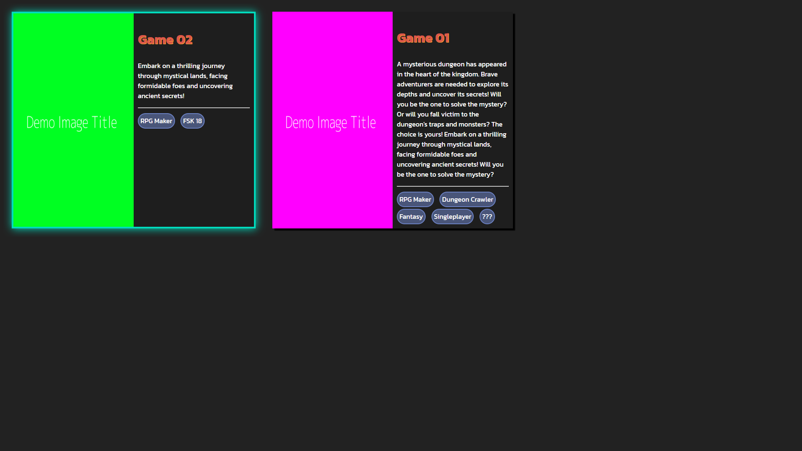

[](https://choosealicense.com/licenses/mit/)

# Game Grid - Web Arcade
A flask wrapper for your WebGL games

## What is Game Grid?
Game Grid is a wrapper for your WebGL games. It provides a simple way to host your games on the web.
Just drop your game files into the `static/games` directory and setup your config.yaml file and you're good to go.
Open the web page, and you'll see your game listed in the grid. You can navigate using the arrow keys and press enter to play the game. 

## Features
- [x] Dockerized
- [x] Modular design
- [x] Easy to use
## Deployment

To deploy this project, clone the repo and run the following command in the root directory:

```bash
  docker-compose up
```
### Add custom Games
To add custom games, just drop your game files into the `static/games` directory and setup your config.yaml file.
```yaml
name: "Game 01"
description: "short description of the game"
tags:
  - "RPG Maker"
  - "Dungeon Crawler"
  - "Fantasy"
  - "Singleplayer"
  - "???"
title_image: "demo-image-001.png"` # name of your title image
```
# Screenshots


# Contact
For any questions or suggestions, please open an issue or contact the repository owner.

# Contributing
Contributions are welcome! Please fork the repository and submit a pull request.